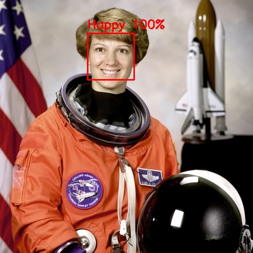

# Real-time Emotion Recognition


👤 **Portfolio:** [s-harshni.github.io/S-Harshni](https://s-harshni.github.io/S-Harshni/)

Detects faces in a live webcam feed and classifies each one into **seven emotions** (Angry, Disgusted, Fear, Happy, Sad, Surprise, Neutral) with a convolutional neural network trained on **FER-2013**.



*Example output on NASA's public-domain astronaut portrait: `Happy: 99.7%`.*

## How it works

```
webcam frame ─► grayscale ─► Haar-cascade face detection ─► crop each face ─► resize to 48×48
            ─► CNN (Conv2D + BatchNorm blocks, softmax over 7 classes) ─► label + confidence ─► draw box
```

- **Face detection:** OpenCV's pre-trained frontal-face Haar cascade.
- **Classifier:** a Keras CNN (26 layers) with input `48×48×1` and 7-way softmax output, trained on FER-2013 (48×48 grayscale faces). It's bundled in `model for recognition.zip` and extracted automatically on first run.
- **Preprocessing:** raw 0–255 grayscale pixels, matching how the model was trained. (Verified: scaling to 0–1 makes predictions wrong.)

## Run

```bash
pip install -r requirements.txt

python emotion_detection.py                         # webcam, press q to quit
python emotion_detection.py --image photo.jpg --output annotated.jpg
python emotion_detection.py --camera 1              # another webcam
```

In Jupyter, run `jupiter_notebook.py`, which shows frames inline.

## Project structure

```
emotion_detection.py        CLI: webcam (real-time window) or single image
jupiter_notebook.py         notebook version (inline frames)
model for recognition.zip   trained Keras model (model.h5, 4 MB)
docs/                       example output
```

## Changes in this version

- Added `emotion_detection.py`, which the README referred to but didn't exist. It runs in real time with an OpenCV window; the old loop blocked on `plt.show()` every frame.
- The model path was hard-coded to `C:/Users/Path/of/model`. The model is now extracted from the bundled zip automatically.
- Works on TensorFlow 2.x / Keras 3. OpenCV is pinned to 4.x because OpenCV 5 removed `CascadeClassifier`.
- Added image mode with confidence scores, `requirements.txt` and an example output.

## Applications

Human-computer interaction, sentiment feedback in interactive systems, and emotion-aware interfaces.

## Author

**S Harshni** · [Portfolio](https://s-harshni.github.io/S-Harshni/) · [LinkedIn](https://www.linkedin.com/in/ks-harshni/) · [GitHub](https://github.com/S-Harshni)

Example image: Eileen Collins, NASA (public domain), via scikit-image's sample data.
